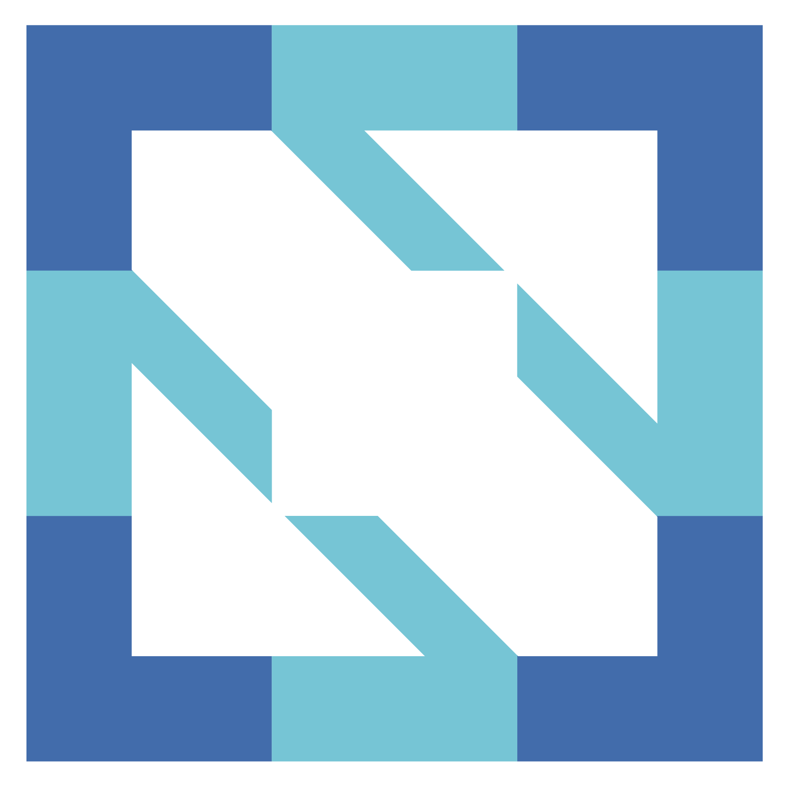
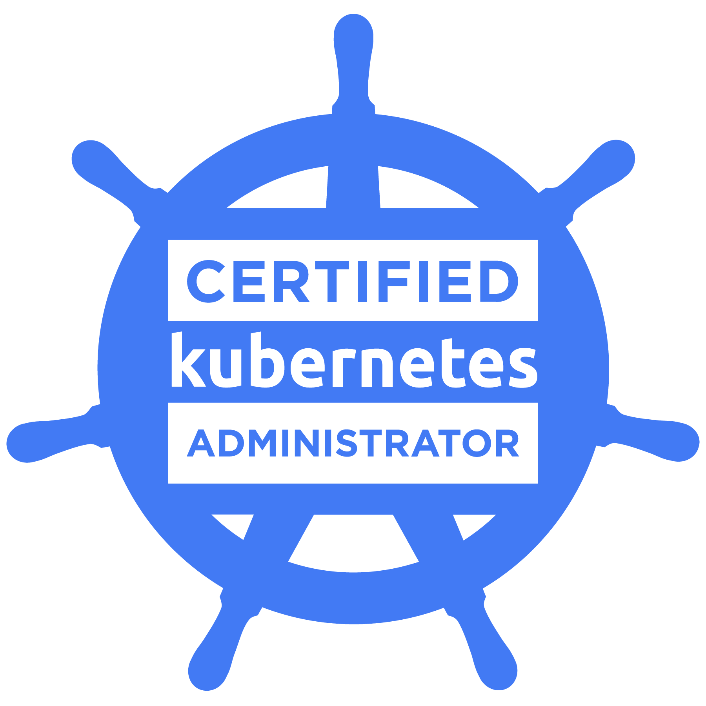
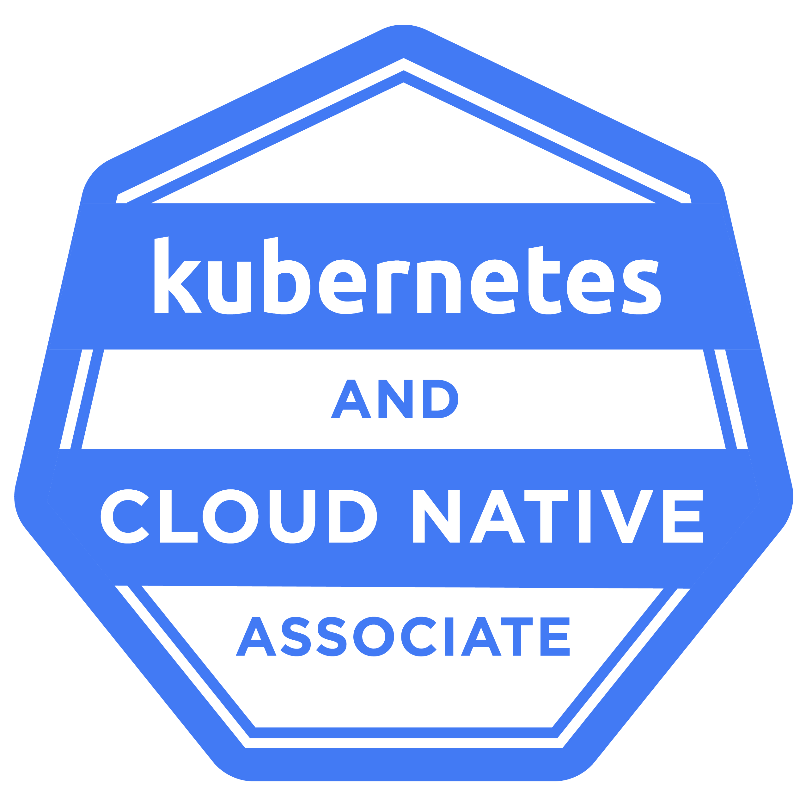

# Onur Canoğlu
**DevOps Engineer** | KCD Istanbul Organizer | KubeSphere Ambassador 2023

## 🔧 Tech Stack

<table border="0">
<tr>
<td width="48%" valign="top">

### 🎯 Core Infrastructure & Orchestration

### 🚀 CI/CD & GitOps

### 🔐 Security & Networking

### 📨 Messaging & Streaming

</td>
<td width="4%"></td>
<td width="48%" valign="top">

### ☁️ Cloud & Infrastructure as Code

### 📊 Observability & Monitoring

### 💾 Data & Storage

### 🛠️ Tools & Ecosystem

</td>
</tr>
</table>

## 🎓 Certifications

**Certified Kubernetes Administrator (CKA)** | **Kubernetes and Cloud Native Associate (KCNA)**

### 📫 Connect With Me

**[Medium](https://medium.com/@onurcanoglu)** • **[LinkedIn](https://linkedin.com/in/onurcanoglu)**

